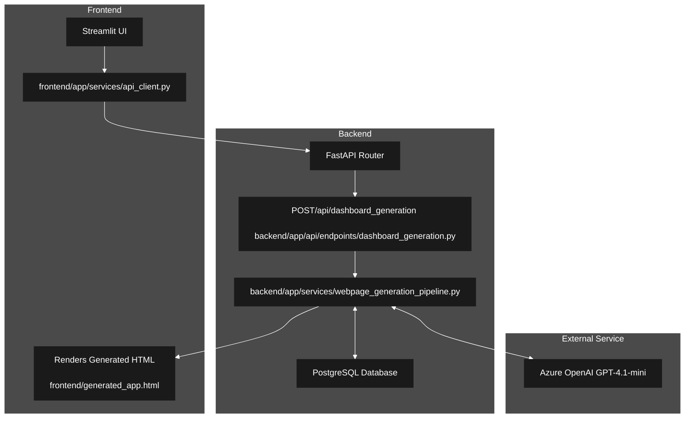

# WebGen AI: Your Dashboard Generation App!

<div align="center">


**AI platform that turns product requirements into market-ready homepages.**

</div>

---

## 📋 Table of Contents

- [Overview](#-overview)
- [Key Features](#-key-features)
- [Tech Stack](#-tech-stack)
- [Project Structure](#-project-structure)
- [Architecture](#-architecture)
- [Prerequisites](#-prerequisites)
- [Running the Project](#-running-the-project)
- [API Documentation](#-api-documentation)
- [Debugging](#-debugging)
- [Contributing](#-contributing)
- [License](#-license)

---

A full-stack application combining FastAPI backend and Streamlit frontend for custom dashboard generation.

## 🔎 Overview

**WebGen AI** is an intelligent webpage generation platform that converts business requirements into fully structured, market-optimized homepages. Powered by LLM-driven market classification and automated content orchestration, it generates production-ready HTML, CSS, and JavaScript tailored to specific industries. Built with Streamlit and FastAPI, it delivers rapid prototyping, scalable architecture, and seamless user interaction.

---

## ✨ Key Features

🔹 **Automated Homepage Generation**  
- Product Input: Users provide product/business details via Streamlit UI  
- Market Classification: LLM selects the best market category  
- Code Generation: Produces complete HTML, CSS, and JS for homepages  
- Rapid Preview: Instantly shows functional homepage previews  
- Production-Ready: Clean, deployable, and market-optimized output  

🔹 **Frontend Excellence**  
- Streamlit UI: Friendly interface for input and preview  
- Smooth Interaction: Easy navigation and instant rendering  
- Responsive Design: Works on different screen sizes  
- Simple Integration: Can run standalone or alongside backend  

🔹 **Backend Power**

- FastAPI Framework: Asynchronous, high-performance backend API
- Azure OpenAI LLM: Intelligent homepage and HTML code generation
- PostgreSQL Database: Persistent storage for markets and template metadata
- SQL-Based Data Layer: Efficient querying and template retrieval
- Structured Logging System: Rotating logs for monitoring and debugging
- Scalable Architecture: Designed to handle concurrent requests efficiently
- Environment-Based Configuration: Secure configuration management via .env

🔹 **Project Structure & Organization**  
- Well-Organized Files: Clear backend/frontend separation  
- Commented Code: Easy to read and extend  
- Optimized Workflow: Suitable for integrated or standalone use  

🔹 **User Experience**  
- Intuitive Input & Output: Streamlined workflow from requirement → preview  
- Minimal Setup: Ready-to-use without complex configurations  

---

## 🛠 Tech Stack

### Frontend

| Category           | Technology                       | Version          | Purpose                                           |
|-------------------|---------------------------------|----------------|-------------------------------------------------|
| UI framework       | Streamlit                        | 1.53.1         | Interactive UI / input & preview               |
| HTTP client        | requests                         | 2.32.5         | Call backend API endpoints                      |
| Language / Runtime | Python                           | 3.13           | Runtime for Streamlit app                       |
| Generated artifact | HTML/CSS/JS                      | N/A            | Output produced by backend LLM pipeline (generated_app.html) |

### Backend

| Category              | Technology                                               | Version  | Purpose                                                    |
|-----------------------|----------------------------------------------------------|----------|------------------------------------------------------------|
| Web Framework         | FastAPI                                                  | 0.128.1  | API endpoints and routing                                  |
| ASGI Server           | Uvicorn                                                  | 0.40.0   | Run FastAPI application                                    |
| Environment Config    | python-dotenv                                            | 1.2.1    | Load environment variables (.env, Azure credentials)       |
| LLM Orchestration     | LangChain (langchain, langchain-openai, langchain-core) | 1.2.8    | Prompt templating, chaining, and LLM interaction           |
| LLM Provider          | Azure OpenAI (AzureChatOpenAI via OpenAI SDK)           | 2.17.0   | Azure-hosted GPT model integration                         |
| Validation & Parsing  | Pydantic (via langchain_core output parsers)            | 2.12.5   | Structured LLM output parsing and validation               |
| Database              | PostgreSQL                                               | 17.7       | Persistent storage for markets and template metadata       |
| Database Driver / ORM | SQLAlchemy         | 2.0.46       | PostgreSQL connectivity and querying                       |
| Logging               | Python Logging (RotatingFileHandler)                    | N/A        | Structured logging and log rotation                        |
| Execution & Utilities | Python Standard Library (time, os, webbrowser, pathlib) | —        | Performance tracking, file handling, HTML execution        |
| Configuration & Core  | Custom Core Modules                                     | N/A      | Centralized settings, DB access layer, logging abstraction |

---

## 📁 Project Structure

```bash
📂 Custom Dashboard Generation/
│
├── 📂 .git/
├── .gitignore
├── LICENSE
├── README.md
├── setup.sh
│
├── 📂 backend/
│   ├── 📂 app/
│   │   ├── 📂 api/
│   │   │   ├── 📂 endpoints/
│   │   │   │   ├── __init__.py
│   │   │   │   ├── dashboard_generation.py
│   │   │   ├── __init__.py
│   │   │   └── router.py
│   │   │
│   │   ├── 📂 core/
│   │   │   ├── __init__.py
│   │   │   ├── config.py
│   │   │   ├── connection.py
│   │   │   └── logging.py
│   │   │
│   │   ├── 📂 database/
│   │   │   ├── __init__.py
│   │   │   └── dashboard_generation.py
│   │   │   └── manage_db.py
│   │   │
│   │   ├── 📂 prompts/
│   │   │   ├── __init__.py
│   │   │   ├── loader.py
│   │   │   ├── market_analyzer_prompt.txt
│   │   │   └── webpage_generation_prompt.txt
│   │   │   └── webpage_generation_from_template_prompt.txt
│   │   │
│   │   ├── 📂 schemas/
│   │   │   ├── __init__.py
│   │   │   └── schema.py
│   │   │   └── db_schema.py
│   │   │
│   │   ├── 📂 services/
│   │   │   ├── __init__.py
│   │   │   └── dashboard_generation_pipeline.py
│   │   │
│   │   ├── 📂 utils/
│   │   │   ├── __init__.py
│   │   │   └── save_generated_snippet.py
│   │   │   └── time_and_cost_estimation.py
│   │   │
│   │   └── __init__.py
│   │   
│   ├── .env
│   ├── main.py
│   ├── requirements.txt
│   └── 📂 logs/ (auto-created)
│
├── 📂 frontend/
│   ├── 📂 app/
│   │   ├── 📂 components/
│   │   │   └── __init__.py
│   │   │
│   │   ├── 📂 pages/
│   │   │   ├── __init__.py
│   │   │   ├── home.py
│   │   │   └── analytics.py
│   │   │
│   │   ├── 📂 services/
│   │   │   ├── __init__.py
│   │   │   └── api_client.py
│   │   │
│   │   ├── 📂 utils/
│   │   │   └── __init__.py
│   │   │
│   │   ├── __init__.py
│   │   └── main.py
│   │
│   ├── .env
│   ├── requirements.txt
│   └── generated_app.html (auto-generated)
```

---

## 🏗️ Architecture

#### • Request Flow


## 💻 Prerequisites

##### Required Software

- **Python**: v3.13 or higher ([Download](https://www.python.org/))
- **PostgreSQL**: v14 or higher ([Download](https://www.postgresql.org/download/))

##### Required Accounts & Keys

1. **Azure OpenAI**: Access key for GPT-4.1-mini (or deployed model)
   - [Get Azure OpenAI Access](https://azure.microsoft.com/en-us/products/ai-services/openai-service)

2. **PostgreSQL Database**
   - Running PostgreSQL instance (local or cloud)
   - Database name, username, password, and connection URL

---
## 🚀 Running the Project

First clone the githb repository using commands:

```bash
git clone https://github.com/Dawar-Imam/Custom-Dashboard-Generator.git
cd "Custom Dashboard Generation"
```

You would need to open 2 terminals for setting up and running backend and frontend respectively.

### Step 1: Backend Setup (Terminal 1)

Run the following commands to setup your backend environement and install necessary libraries.

```bash
python -m venv backend/venv
backend\venv\Scripts\activate
pip install -r backend/requirements.txt
```

#### Configure Backend Environment
Create/update `backend/.env` with your Azure OpenAI credentials:
```
# Backend environment variables
# Azure OpenAI configuration
AZURE_OPENAI_API_KEY=your_azure_openai_key_here
AZURE_OPENAI_ENDPOINT=https://your-resource-name.openai.azure.com/
AZURE_OPENAI_DEPLOYMENT_NAME=your_deployment_name_here
AZURE_OPENAI_API_VERSION=2024-12-01-preview

# PostgreSQL database configuration
PG_HOST=localhost
PG_PORT=5432
PG_USER_NAME=your_postgres_username
PG_PASSWORD=your_postgres_password
PG_DATABASE=your_database_name
```

#### Start Backend
Run the following command to start backend:

```bash
python backend/main.py
```
✅ Backend will run at: `http://127.0.0.1:8000`

### Step 2: Frontend Setup (Terminal 2)

Now start a new terminal seperate from backend one and make sure no environment is activated in it. Assuming you are on root directory:

```bash
python -m venv frontend/venv
frontend\venv\Scripts\activate
pip install -r frontend/requirements.txt
```

### Step 5: Start Frontend (Terminal 2)

To run streamlit app from root directory use the following command:
```bash
streamlit run ronten/app/main.py
```
✅ Frontend will run at: `http://localhost:8501`

---

## 📚 API Documentation

#### Interactive Documentation

- **Swagger UI**: http://localhost:8000/docs
- **ReDoc**: http://localhost:8000/redoc

#### Public Endpoints

| Method | Endpoint | Description | Request Body | Example Payload |
|--------|----------|-------------|--------------|-----------------|
| POST | `/api/dashboard_generation` | Generates dynamic dashboard HTML using LLM pipeline. | `{ "text": "string" }` | `{ "text": "Create an E-Commerce homepage for me." }` |

---

## ⚙️ Debugging

If you are using VSCode, Heres how you can debug your project once you have downloaded, setup the .env file, and installed packages in your virtual environments:

1. Open **Run** from the top menu bar.
2. Click **“Add Configuration…”**.
3. Select **Python**.
4. Choose **Python File**.
5. VSCode will create a `launch.json` file automatically.
6. Remove everything inside `launch.json`.
7. Paste the following configuration into `launch.json`:

```bash
{
    "version": "0.2.0",
    "configurations": [
        
        {
            "name": "Backend (python)",
            "type": "debugpy",
            "request": "launch",
            "program": "${workspaceFolder}/backend/main.py",
            "console": "integratedTerminal",
            "cwd": "${workspaceFolder}/backend",
            "envFile": "${workspaceFolder}/backend/.env",
            "python": "${workspaceFolder}/backend/venv/Scripts/python.exe"

        },
        {
            "name": "Frontend (Streamlit)",
            "type": "debugpy",
            "request": "launch",
            "module": "streamlit",
            "args": [
                "run",
                "app/main.py"
            ],
            "console": "integratedTerminal",
            "cwd": "${workspaceFolder}/frontend",
            "envFile": "${workspaceFolder}/frontend/.env",
            "python": "${workspaceFolder}/frontend/venv/Scripts/python.exe"

        }
    ],
    "compounds": [
        {
            "name": "Full App (Backend + Frontend)",
            "configurations": [
                "Backend (debugpy)",
                "Frontend (Streamlit)"
            ]
        }
    ]
}
```
---

## 🤝 Contributing

We welcome contributions! Please follow these guidelines:

### Development Workflow

1. **Fork the repository**
2. **Create a feature branch**: `git checkout -b feature/amazing-feature`
3. **Make your changes**
4. **Test thoroughly**
5. **Commit with meaningful messages**: `git commit -m 'Add amazing feature'`
6. **Push to branch**: `git push origin feature/amazing-feature`
7. **Open a Pull Request**

### Code Standards

- **Frontend**: Follow ESLint rules, use TypeScript strictly
- **Backend**: Follow PEP 8, use type hints
- **Commits**: Use conventional commits (feat:, fix:, docs:, etc.)
- **Documentation**: Update README and relevant docs

---

## 📄 License

This project is licensed under the **MIT License**.

```
MIT License

Copyright (c) 2024 AIIM ONE

Permission is hereby granted, free of charge, to any person obtaining a copy
of this software and associated documentation files (the "Software"), to deal
in the Software without restriction, including without limitation the rights
to use, copy, modify, merge, publish, distribute, sublicense, and/or sell
copies of the Software, and to permit persons to whom the Software is
furnished to do so, subject to the following conditions:

The above copyright notice and this permission notice shall be included in all
copies or substantial portions of the Software.

THE SOFTWARE IS PROVIDED "AS IS", WITHOUT WARRANTY OF ANY KIND, EXPRESS OR
IMPLIED, INCLUDING BUT NOT LIMITED TO THE WARRANTIES OF MERCHANTABILITY,
FITNESS FOR A PARTICULAR PURPOSE AND NONINFRINGEMENT.
```